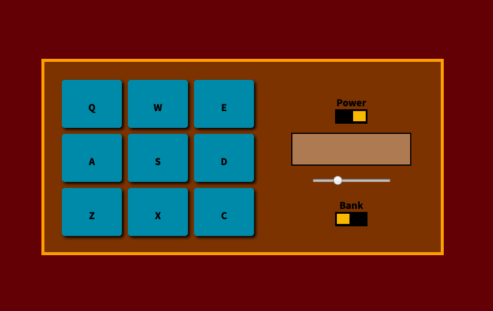

# Drum_Machine
A front-end web development project in ReactJS. I wrote a blog post about the project, where you can read about programming concepts I used and about app's features and functionality. You can find it on my [medium profile](https://medium.com/@marko.libor/drum-machine-5242f2a62f75).

## Technologies used
* React.JS
* JavaScript 
* HTML5
* CSS3

## Setup and Run

Try the app [here](https://8t5dk.csb.app/).

## Screenshot of the App
